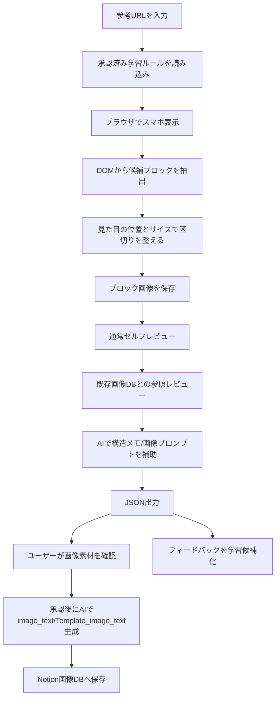

# 競合サイト素材区切りツール

比較リスティングLPの参考URLを入力すると、スマホ表示の画面を読み取り、ファーストビュー、比較表、ランキング、個別候補詳細、口コミ、FAQ、CTAなどの「制作素材として使いやすい単位」で画像を切り出し、Notionの画像データベースへ保存するためのツールです。

このツールの重要な考え方は、**AIに画像を丸ごと見せて区切らせているのではない**という点です。ページの表示、候補の抽出、区切り位置の決定、スクリーンショット保存、Notion保存はプログラムで処理します。AIは、切り出した後の説明文や画像生成プロンプトの作成を補助する役割です。

## 何ができるか

- 参考URLを複数まとめて読み込む
- LPをスマホ幅で開き、見た目とDOM情報から素材ブロックを自動抽出する
- ファーストビュー、比較表、ランキング、口コミ、FAQ、CTAなどに分類する
- 各ブロックのスクリーンショットを保存する
- 既存の画像データベースを参照し、過去の区切りと大きく違わないかレビューする
- ユーザーからのフィードバックを次回以降の学習ルール候補として保存する
- dry-runでローカル確認し、ユーザーOK後にNotion画像DBへ保存する
- 承認済み画像から、再生成用の詳細プロンプト `image_text` と汎用テンプレート `Template_image_text` を作る
- 既存DB行に対しても、ローカルartifactの画像を使って `image_text` / `Template_image_text` を後追い補完する

## 全体像



## プログラムが処理すること、AIが処理すること

| 処理 | 担当 | 内容 |
| --- | --- | --- |
| 参考URLを開く | プログラム | Playwrightというブラウザ操作ライブラリでLPを開きます。 |
| スマホ表示にする | プログラム | 横幅390pxのスマホ表示でページを読み込みます。 |
| 候補ブロックを探す | プログラム | DOMから `section`、`table`、ランキング、比較表、FAQ、CTAなどの候補を拾います。 |
| 区切り位置を決める | プログラム | 候補の位置、サイズ、テキスト、親子関係、重なり具合を見て決めます。 |
| スクリーンショットを切り出す | プログラム | 決まった座標に沿って画像を保存します。 |
| 大分類/詳細ラベルの初期判定 | プログラム | 「ファーストビュー」「比較表」「ランキング本文」などをルールで付けます。 |
| 既存DBとのズレ確認 | プログラム | 過去のNotion画像DBと比較し、ブロック数やラベル順序の差を見ます。 |
| フィードバックのルール候補化 | プログラム | ユーザーの指摘を `pending_rules.json` に構造化して保存します。 |
| 構造メモの補助 | AI | OpenAI APIがある場合、切り出した画像の構成説明を補助します。 |
| 画像生成プロンプトの補助 | AI | OpenAI APIがある場合、似た構成の画像を作るためのプロンプトを補助します。 |
| 承認後の詳細プロンプト生成 | AI | ユーザーOK後、画像から逆算した `image_text` と汎用化した `Template_image_text` を作ります。 |

現行の実装では、素材の境界そのものはAIではなくプログラムが決めます。AIが使われるのは、切り出し後の「このブロックはどんな構成か」「画像生成時にどう再現するか」を言語化する部分です。`--no-openai` を付けると、このAI補助を使わずに実行できます。

## 参考URLを入れると起きること

1. URL一覧を読み込みます。
2. PlaywrightがLPをスマホ幅で表示します。
3. ページ下部まで一度スクロールし、遅延読み込み画像や下部コンテンツを表示させます。
4. DOMから素材候補を広めに拾います。
5. 小さすぎる要素、見えない要素、テキストが少なすぎる要素を除外します。
6. 候補を上から順に並べ、重複、親子関係、重なりを整理します。
7. ファーストビュー、比較表、ランキング、個別候補詳細、FAQ、CTAなどに分類します。
8. 各ブロックを画像として切り出します。
9. `--reference-review` がある場合、既存Notion DBの過去ブロックと比較します。
10. OpenAI APIがある場合、構造メモと従来の画像生成プロンプトを補助します。
11. JSONに実行結果を保存します。
12. dry-runの画像をユーザーが確認します。
13. 問題なければ `finalize-block-capture --confirm-reviewed` を実行します。
14. AIが `image_text` と `Template_image_text` を生成し、画像と一緒にNotion画像DBへ保存します。

## DOMとは何か

DOMは、Webページの中身をプログラムが読めるようにした構造です。人間が見ているLPは、裏側では「見出し」「画像」「表」「ボタン」「ランキング枠」などの部品として並んでいます。

このツールは、画面をただ画像として見るのではなく、DOMから「ここは表らしい」「ここはランキングらしい」「ここはCTAボタンらしい」という候補を拾います。そのうえで、実際の画面上の位置とサイズも見て、素材として切り出す範囲を決めます。

## 区切りの基本方針

区切りの目的は、HTMLの部品を細かく分解することではありません。制作素材として再利用しやすい「意味と見た目のまとまり」で切り出すことです。

たとえば、以下のように考えます。

| LP上の内容 | 基本の切り出し方 |
| --- | --- |
| ファーストビュー | 冒頭の訴求、ランキング訴求、CTA、信頼要素を1つのまとまりとして切り出す |
| 一括比較表 | 見出し、表本体、表内CTAが近い場合は1つの比較表ブロックとして切り出す |
| 1商品ずつの比較カード | 1位、2位、3位など商品ごとに別ブロックとして切り出す |
| ランキング本文 | 商品全体を大きく1つにしすぎず、基本情報、症例、口コミ、限定オファー、店舗情報などに分ける |
| 基礎解説 | 選び方、料金、仕組み、注意点など、読み物として1テーマのまとまりで切り出す |
| FAQ | 質問と回答のまとまりをFAQブロックとして切り出す |
| CTA | 単独の小さなボタンだけで大量に切らず、近い本文やランキング詳細に吸収できる場合は吸収する |

## 実際の切り出し基準

プログラムは主に以下の基準を組み合わせて判断します。

### 1. スマホ表示を基準にする

比較リスティングLPはスマホ閲覧を前提に作られていることが多いため、横幅390pxのスマホ表示で判定します。PC表示では横並びだった表やカードが、スマホでは縦積みになるため、スマホの見え方を正とします。

### 2. DOMの種類を見る

候補として見る主なDOMは以下です。

- `header`
- `section`
- `article`
- `table`
- `hero`、`fv`、`first` を含む要素
- `compare`、`comparison`、`hikaku` を含む要素
- `rank`、`ranking` を含む要素
- `faq`、`qa` を含む要素
- `cta` を含む要素

加えて、よくある比較LPの構造に合わせて、ランキング内の基本情報、症例、口コミ、キャンペーン、店舗一覧、CTAなども拾います。

### 3. 小さすぎる候補を落とす

幅が狭すぎるもの、縦幅が小さすぎるもの、テキストがほとんどないものは素材として扱いにくいため除外します。ただしCTAボタンは小さいことが多いため、通常ブロックより小さくても候補に残します。

### 4. ファーストビューは特別扱いする

ファーストビューはDOM上できれいに1つの `section` になっていないことがあります。そのため、ページ冒頭に仮想的な `first-view` ブロックを作ります。

ただし、ファーストビューが次の比較表やランキングまで飲み込まないように、次の大きなセクションが始まる位置で高さを調整します。

### 5. 親子の重複を落とす

Webページでは、親ブロックの中に子ブロックが入っています。親も子も両方保存すると、ほぼ同じ画像が重複します。

そのため、親子関係や重なりを見て、同じ内容を二重に保存しないようにします。巨大な親ブロックがあり、その中に意味のある子ブロックが複数ある場合は、親を落として子を残します。

### 6. 近い比較表要素はまとめる

比較表は、見出し、表本体、表下のCTAが別DOMになっていることがあります。画面上で近く、内容も比較表として一体なら、1つの比較表ブロックにまとめます。

### 7. ランキング本文は分解しすぎず、まとめすぎない

ランキング本文は特に重要です。1商品全体を1枚にまとめると、基本情報、症例、口コミ、オファーなどが入りすぎます。一方で、ボタンや細かい行ごとに分けると素材として使いにくくなります。

そのため、以下のような意味単位を優先します。

- 個別候補の基本情報
- おすすめポイント
- 効果/症例/Before After
- 口コミ/体験談
- 限定オファー
- 店舗/地域一覧
- CTA反復

### 8. 既存画像DBと比較する

`--reference-review` を付けると、既存のNotion画像DBを参照します。比較の優先順位は以下です。

1. 同じURLの過去ブロック
2. 同じドメインの過去ブロック
3. 同じカテゴリに近い過去ブロック

比較する内容は、ブロック数、詳細ラベルの順番、ファーストビューや比較表など主要ブロックの有無、過結合、過分割、1商品表の誤ラベルです。

大きなズレがある場合は `要確認` として記録します。初期設定では保存を止めません。保存前に止めたい場合は `--fail-on-reference-warning` を使います。

## 出力されるJSON

実行結果のJSONには、主に以下が入ります。

- `run.block_count`: 取得したブロック数
- `run.failed_urls`: 取得に失敗したURL
- `run.review_warnings`: 通常セルフレビューの警告
- `run.reference_review`: 既存画像DBとの参照レビュー結果
- `run.learning`: 適用された学習ルール
- `run.blocks`: 各ブロックの詳細

各ブロックには、以下のような情報が入ります。

- 元URL
- ドメイン
- ページタイトル
- 表示幅
- ブロック順
- ブロック大分類
- 詳細ラベル
- スクリーンショット画像パス
- 構造メモ
- 画像生成プロンプト
- image_text
- Template_image_text
- スクショ範囲
- 参照レビュー状態
- 参照一致度
- 参照Run ID

## Notion画像DBに保存される主な項目

- 名前
- 元URL
- ドメイン
- ページタイトル
- Run ID
- 表示幅
- ブロック順
- ブロック大分類
- 詳細ラベル
- ブロック画像
- 構造メモ
- 画像生成プロンプト
- image_text
- Template_image_text
- プロンプト状態
- 信頼度
- 抽出日時
- スクショ範囲
- ステータス
- 参照レビュー状態
- 参照一致度
- 参照レビュー
- 参照Run ID

## 2つの追加エージェント

### ReferenceReviewAgent

既存の画像データベースを参照し、今回の切り方が過去の良い切り方と大きく違っていないかを確認します。

主に見るポイントは以下です。

- 過去よりブロック数が少なすぎないか
- 過去よりブロック数が多すぎないか
- 主要な詳細ラベルの順番が大きく違わないか
- ランキング本文が大きくまとまりすぎていないか
- 比較表が細切れになりすぎていないか
- 1商品ずつの詳細表を一括比較表と誤判定していないか

### FeedbackLearningAgent

ユーザーの指摘を、次回以降に活かすための学習ルール候補として保存します。

たとえば、ユーザーが「ランキング本文がまとまり過ぎている。基本情報、症例、口コミ、オファーは分けたい」とフィードバックした場合、`learning/pending_rules.json` に以下のような候補が作られます。

- 対象: ランキング周辺
- 問題: まとまりすぎ
- 希望: 基本情報、症例、口コミ、限定オファーに分ける
- 状態: pending

確認して問題ないルールだけ `learning/approved_rules.json` に移すと、次回以降の実行時に自動適用されます。

## 使うコマンド

dry-run:

```bash
python3 -m research_os capture-blocks \
  --category-name マウスピース矯正 \
  --competitor-url https://example.com/ \
  --dry-run \
  --out artifacts/block-capture-dry-run.json
```

ユーザーOK後のNotion保存:

```bash
python3 -m research_os finalize-block-capture \
  --run-artifact artifacts/block-capture-dry-run.json \
  --category-name マウスピース矯正 \
  --confirm-reviewed \
  --out artifacts/block-capture-finalized.json
```

`finalize-block-capture` は、dry-runで作成された画像をユーザーが確認してOKを出した後に実行します。この段階では `OPENAI_API_KEY` が必須です。

既存DB行の後追い補完:

```bash
python3 -m research_os backfill-block-image-text \
  --category-name マウスピース矯正 \
  --artifact artifacts/block-capture-dry-run.json \
  --confirm-update \
  --concurrency 4 \
  --out artifacts/block-image-text-backfill.json
```

フィードバック学習:

```bash
python3 -m research_os learn-block-feedback \
  --run-artifact artifacts/block-capture-notion.json \
  --feedback-file feedback.txt \
  --out learning/pending_rules.json
```

## よくある失敗と確認方法

- Notionに保存されない: `.env` の `NOTION_API_KEY` と `COMPETITOR_BLOCK_DB_ID` を確認してください。
- ブラウザ起動で失敗する: `python3 -m playwright install chromium` を実行してください。
- 画像が大きすぎる: Notionの直接アップロード上限を超えると `画像過大` になります。
- 区切りが粗い/細かい: `run.review_warnings` と `run.reference_review` を確認してください。
- AI補助が動かない: `OPENAI_API_KEY` が設定されているか確認してください。未設定でも切り出し自体は動きます。
- 承認後保存が止まる: `finalize-block-capture` には `--confirm-reviewed` と `OPENAI_API_KEY` が必要です。
- 後追い補完で更新されない: `backfill-block-image-text` の `--artifact` が、Notion行の `Run ID` / `ドメイン` / `ブロック順` と対応しているか確認してください。
- 参照レビューが `no_reference` になる: `--reference-review`、`NOTION_API_KEY`、`COMPETITOR_BLOCK_DB_ID`、対象DBの共有設定を確認してください。

詳しい導入手順は [SETUP.md](SETUP.md)、日常運用は [OPERATIONS.md](OPERATIONS.md) を見てください。
