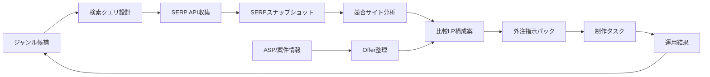

# 比較リス案件 業務効率化OS V1 Architecture

## 目的

比較リス案件の複数ジャンル展開で詰まりやすい、競合収集、案件整理、構成作成、外注指示を標準化する。Notionを正本にしつつ、API実行と分析はCLIに分離する。

## 役割分担

- Notion: ジャンル、クエリ、SERP、競合、案件、訴求、構成、外注指示、制作、運用結果の正本。
- Notion AI: Notion内の横断検索、既存ナレッジの要約、ジャンル別レポート下書き。
- Codex/CLI: API実行、正規化、重複排除、スコアリング、Markdown成果物生成。
- 外部API: SERPとキーワード指標の取得。V1はDataForSEOを第一候補にする。
- 人間: ASP交渉、ジャンル判断、広告審査リスク判断、外注先の最終指示。

## データフロー

## 実装単位

- `listing_os.normalization`: URL、ドメイン、トラッキングクエリ除去。
- `listing_os.providers.dataforseo`: DataForSEO SERP/Keyword APIクライアント。
- `listing_os.notion.schema`: 10DBのNotionスキーマ生成とrelation更新用変換。
- `listing_os.notion.client`: Notion APIの最小クライアント。
- `listing_os.workflows`: 競合分析、外注指示生成、外注共有用サニタイズ。
- `listing_os.cli`: `init-schema`、`collect-serp`、`analyze-sites`、`generate-brief`、`export-vendor-pack`。

## 共有前提

他社に共有するものは、コード、README、docs、examples、configテンプレートです。共有してはいけないものは `.env`、`artifacts/`、Notion APIキー、DataForSEO認証情報、クライアント固有の未公開メモです。
